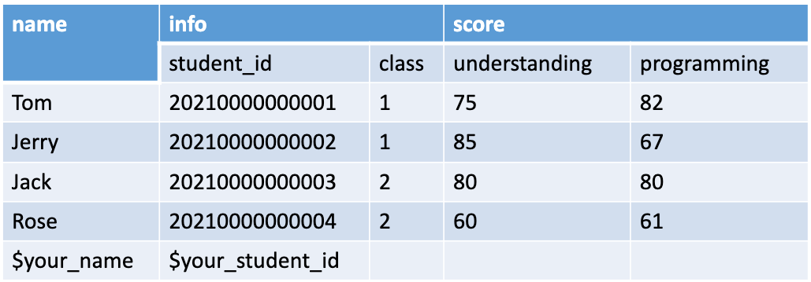
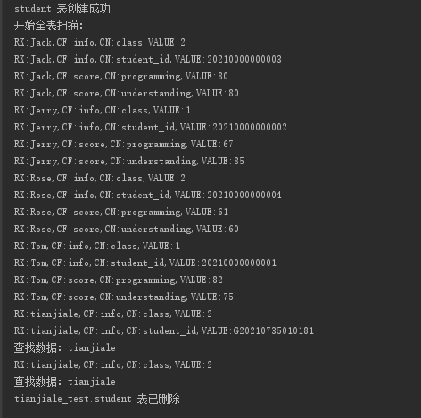

# 编程实践，使用 API 操作HBase
> 建表，插入数据，删除数据，查询等功能。建立一个如下所示的表



               

## 代码
```java
public class HBaseUtils {

    public static Connection connection = null;
    public static HBaseAdmin admin = null;

    public static final String TABLE_NAME ="tianjiale_test:student";
    public static final String ZK_CONNECT_INFO = "47.101.206.249:2181,47.101.216.12:2181,47.101.204.23:2181";
    public static final String[] COLUMN_FAMILYS = {"info", "score"};

    static {
        Configuration config = HBaseConfiguration.create();// 配置
        config.set("hbase.zookeeper.quorum", ZK_CONNECT_INFO);// zookeeper地址
        try {
            connection = ConnectionFactory.createConnection(config);
            // 创建 HBase 表管理类
            admin = (HBaseAdmin) connection.getAdmin();
        } catch (IOException e) {
            e.printStackTrace();
        }
    }

    public static void close() throws IOException {
        if(admin != null) {
            admin.close();
        }
        if(connection != null) {
            connection.close();
        }
    }

    //判断表是否存在
    public static boolean tableExists(String tableName) throws IOException {
        boolean tableExists = admin.tableExists(TableName.valueOf(tableName));
        return tableExists;
    }

    //创建表
    public static void creatTable(String tableName, String[] cfs) throws IOException {
        if (tableExists(tableName)) {
            System.out.println("该表已存在...");
            return;
        }

        //表名
        TableName student = TableName.valueOf(tableName);
        //表建造者
        TableDescriptorBuilder tableDescriptorBuilder = TableDescriptorBuilder.newBuilder(student);

        for(String cf : cfs){
            ColumnFamilyDescriptorBuilder columnFamilyDescriptorBuilder = ColumnFamilyDescriptorBuilder.newBuilder(Bytes.toBytes(cf));
            columnFamilyDescriptorBuilder.setMaxVersions(3);
            ColumnFamilyDescriptor columnFamilyDescriptor = columnFamilyDescriptorBuilder.build();
            tableDescriptorBuilder.setColumnFamily(columnFamilyDescriptor);
        }
        TableDescriptor tableDescriptor = tableDescriptorBuilder.build();
        admin.createTable(tableDescriptor);

        if (tableExists(tableName)) {
            System.out.println("student 表创建成功");
        } else {
            System.out.println("student 表创建失败");
        }

    }

    //删除表
    public static void deleteTable(String tableName) throws IOException{
        if(!tableExists(tableName)) {
            System.out.println(tableName + " 表不存在");
            return;
        }
        TableName student = TableName.valueOf(tableName);
        admin.disableTable(student);
        admin.deleteTable(student);
        System.out.println(tableName + " 表已删除");
    }

    //插入数据
    public static void putData(String tableName, String rowKey, String cf, String columnName, String value) throws IOException {
        Table table = connection.getTable(TableName.valueOf(tableName));

        Put put = new Put(Bytes.toBytes(rowKey));
        put.addColumn(Bytes.toBytes(cf),Bytes.toBytes(columnName),Bytes.toBytes(value));
        table.put(put);

    }

    private static void initData(String tableName) throws IOException {
        putData(TABLE_NAME, "Tom", "info", "student_id", "20210000000001");
        putData(TABLE_NAME, "Tom", "info", "class", "1");
        putData(TABLE_NAME, "Tom", "score", "understanding", "75");
        putData(TABLE_NAME, "Tom", "score", "programming", "82");

        putData(TABLE_NAME, "Jerry", "info", "student_id", "20210000000002");
        putData(TABLE_NAME, "Jerry", "info", "class", "1");
        putData(TABLE_NAME, "Jerry", "score", "understanding", "85");
        putData(TABLE_NAME, "Jerry", "score", "programming", "67");


        putData(TABLE_NAME, "Jack", "info", "student_id", "20210000000003");
        putData(TABLE_NAME, "Jack", "info", "class", "2");
        putData(TABLE_NAME, "Jack", "score", "understanding", "80");
        putData(TABLE_NAME, "Jack", "score", "programming", "80");


        putData(TABLE_NAME, "Rose", "info", "student_id", "20210000000004");
        putData(TABLE_NAME, "Rose", "info", "class", "2");
        putData(TABLE_NAME, "Rose", "score", "understanding", "60");
        putData(TABLE_NAME, "Rose", "score", "programming", "61");

    }

    //删除数据
    public static void deleteData(String tableName, String rowKey, String cf, String columnName) throws IOException {
        Table table = connection.getTable(TableName.valueOf(tableName));

        // 创建 delete 对象
        Delete delete = new Delete(Bytes.toBytes(rowKey));
        delete.addColumns(Bytes.toBytes(cf),Bytes.toBytes(columnName)); // 删除所有版本
        table.delete(delete);

    }

    //全表扫描
    private static void scanTable(String tableName) throws IOException {
        System.out.println("开始全表扫描：");
        Table table = connection.getTable(TableName.valueOf(tableName));
        Scan scan = new Scan();
        ResultScanner scanner = table.getScanner(scan);

        // 遍历数据并打印
        for (Result result : scanner) {
            printResult(result);
        }
    }

    //查找数据
    private static void getDate(String tableName, String rowKey, String cf, String columnName) throws IOException {
        System.out.println("查找数据："+rowKey);
        Table table = connection.getTable(TableName.valueOf(tableName));
        Get get = new Get(Bytes.toBytes(rowKey));
        get.addColumn(Bytes.toBytes(cf),Bytes.toBytes(columnName));

        Result result = table.get(get);
        printResult(result);


    }

    public static void printResult(Result result) {
//        System.out.println(result);
        Cell[] cells = result.rawCells();
        for(Cell cell : cells) {
            System.out.println("RK:"+Bytes.toString(CellUtil.cloneRow(cell))+",CF:"
                    +Bytes.toString(CellUtil.cloneFamily(cell))+",CN:"
                    +Bytes.toString(CellUtil.cloneQualifier(cell))+",VALUE:"
                    +Bytes.toString(CellUtil.cloneValue(cell))
            );
        }
    }


    public static void main(String[] args) throws Exception {

        // 创建表
        creatTable(TABLE_NAME, COLUMN_FAMILYS);

        //初始化表数据
        initData(TABLE_NAME);

        //插入自己的个人信息
        putData(TABLE_NAME, "tianjiale", "info", "student_id", "G20210735010181");
        putData(TABLE_NAME, "tianjiale", "info", "class", "2");

        //全表扫描
        scanTable(TABLE_NAME);
        getDate(TABLE_NAME,"tianjiale", "info", "class");

//        putData(TABLE_NAME, "tianjiale", "info", "class", "20");
//        putData(TABLE_NAME, "tianjiale", "info", "class", "30");
//
//        getDate(TABLE_NAME,"tianjiale", "info", "class");
        deleteData(TABLE_NAME,"tianjiale", "info", "class");

        getDate(TABLE_NAME,"tianjiale", "info", "class");

        //删除表
        deleteTable(TABLE_NAME);

        //关闭资源
        close();

    }


}
```

## 运行结果

