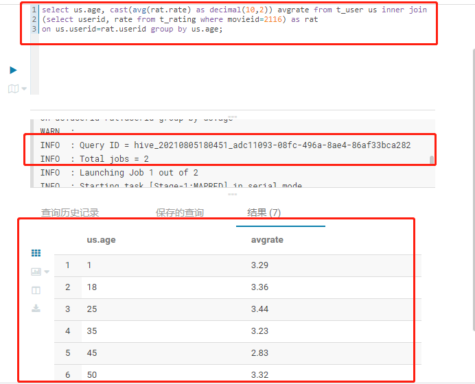
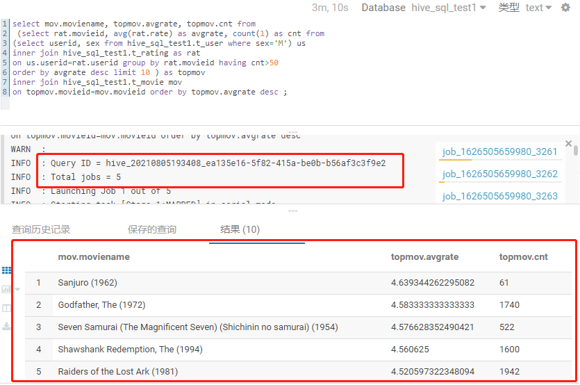
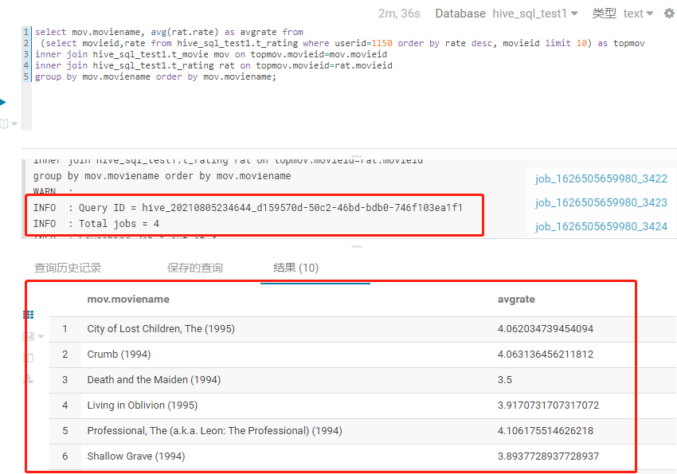

# Hive SQL 练习

## 题目一：
>展示电影ID为2116这部电影各年龄段的平均影评分。
### SQL 代码
``` sql
# 年龄，平均影评分（小数点后保留两位小数）
select us.age, cast(avg(rat.rate) as decimal(10,2)) avgrate from t_user us inner join 
(select userid, rate from t_rating where movieid=2116) as rat 
on us.userid=rat.userid group by us.age;
```
### 运行结果

## 题目二：
>找出男性评分最高且评分次数超过50次的10部电影，展示电影名，平均影评分和评分次数。
### SQL 代码
``` sql
# 电影名，平均影评分，评分次数
select mov.moviename, topmov.avgrate, topmov.cnt from 
 (select rat.movieid, avg(rat.rate) as avgrate, count(1) as cnt from 
(select userid, sex from hive_sql_test1.t_user where sex='M') us 
inner join hive_sql_test1.t_rating as rat 
on us.userid=rat.userid group by rat.movieid having cnt>50 
order by avgrate desc limit 10 ) as topmov 
inner join hive_sql_test1.t_movie mov 
on topmov.movieid=mov.movieid order by topmov.avgrate desc ;
```
### 运行结果

## 题目三：
>找出影评次数最多的女士所给出最高分的10部电影的平均影评分，展示电影名和平均影评分。
### SQL 代码
``` sql
#先找出影评次数最多的女士
 select us.userid, count(1) as cnt from 
(select userid from hive_sql_test1.t_user where sex='F') us 
inner join hive_sql_test1.t_rating as rat 
on us.userid=rat.userid group by us.userid
order by cnt desc limit 1;

#影评次数最多的女士的userid=1150，找出其给出最高分的10部电影（按分数,movieid排序），再计算这10部电影的名字和平均影评分数
select mov.moviename, avg(rat.rate) as avgrate from 
 (select movieid,rate from hive_sql_test1.t_rating where userid=1150 order by rate desc, movieid limit 10) as topmov 
inner join hive_sql_test1.t_movie mov on topmov.movieid=mov.movieid 
inner join hive_sql_test1.t_rating rat on topmov.movieid=rat.movieid 
group by mov.moviename order by mov.moviename;
```
### 运行结果

