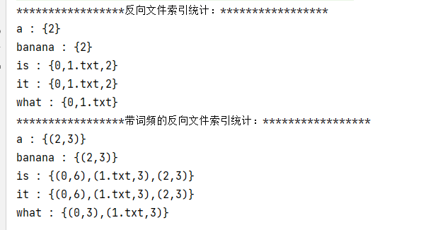

# 作业一 使用RDD API实现带词频的倒排索引
> 倒排索引（Inverted index），也被称为反向索引。它是文档检索系统中最常用的数据结构。被广泛
地应用于全文搜索引擎。

例子如下，被索引的文件为（0，1，2代表文件名）
```shell
0. "it is what it is"
1. "what is it"
2. "it is a banana"
```
我们就能得到下面的反向文件索引：
``` json
"a": {2} 
"banana": {2} 
"is": {0, 1, 2} 
"it": {0, 1, 2} 
"what": {0, 1} 
```
再加上词频为：
``` json
"a": {(2,1)} 
"banana": {(2,1)} 
"is": {(0,2), (1,1), (2,1)} 
"it": {(0,2), (1,1), (2,1)} 
"what": {(0,1), (1,1)}
```
               

## 代码
```scala
package com.tom.spark.core

import org.apache.spark.rdd.RDD
import org.apache.spark.{SparkConf, SparkContext}

object SparkInvertedIndex {

  def main(args: Array[String]) {
    val inputFile = "datas/index"
    val sparkConf = new SparkConf().setMaster("local").setAppName("SparkInvertedIndex")
    val sc: SparkContext = new SparkContext(sparkConf)

    // 读取文件内容，创建 RDD 对象
    val inputRDD: RDD[(String, String)] = sc.wholeTextFiles(inputFile)

    //(文件名，文件内容)  文件内容中的换行符已替换为空格
    val mapRDD: RDD[(String, String)] = inputRDD.map {
      case (filePath, fileContent) => {
        val fileName: String = filePath.split("/").last
        val content: String = fileContent.replaceAll(System.lineSeparator(), " ")
        (fileName, content)
      }
    }

    //(文件名，单词)
    val fileNameWordRDD: RDD[(String, String)] = mapRDD.flatMapValues(_.split(" ")).cache()

    // 反向文件索引，并在控制台输出结果
    calcInvertedIndex(fileNameWordRDD)

    // 反向文件索引带上词频，并在控制台输出结果
    calcInvertedIndexWithWordFreq(fileNameWordRDD)

    sc.stop()


  }

  def calcInvertedIndex(fileWordRDD : RDD[(String, String)]) : Unit = {
    //(单词，文件名)
    val wordFileName: RDD[(String, String)] = fileWordRDD.map {
      case (fileName, word) => (word, fileName)
    }

    //(单词，[（文件1），（文件2），（文件3）...])，并按单词排序
    val invertedIndex: RDD[(String, Iterable[String])] = wordFileName.groupByKey().sortByKey()

    // (单词，[（单词出现的文件名1），（文件2），（文件3）...])，文件名已去重
    val distinctInvertedIndex: RDD[(String, List[String])] = invertedIndex.mapValues(iterator => iterator.toList.distinct)

    println("*****************反向文件索引统计：*****************")
    distinctInvertedIndex.collect().foreach(
      item => println(item._1+" : "+item._2.mkString("{",",","}"))
    )

  }


  def calcInvertedIndexWithWordFreq(fileWordRDD : RDD[(String, String)]) : Unit = {
    //（(单词，文件名)，出现次数）=> (单词，（文件名，出现次数）)
    val wordFileCounts: RDD[(String, (String, Int))] = fileWordRDD.map {
      case (fileName, word) => ((word, fileName), 1)
    }.reduceByKey(_ + _).map {
      case ((word, fileName), count) => (word, (fileName, count))
    }

    //(单词，[（文件1，出现次数），（文件2，出现次数），（文件3，出现次数）...])，并按单词排序
    val invertedIndex: RDD[(String, Iterable[(String, Int)])] = wordFileCounts.groupByKey().sortByKey()

    // (单词，List[（文件1，出现次数），（文件2，出现次数），（文件3，出现次数）...]) ,按 valuse 中的文件名排序
    val sortedInvertedIndex: RDD[(String, List[(String, Int)])] = invertedIndex.mapValues(item => {
      item.toList.sortBy(_._1)(Ordering.String)
    })
    println("*****************带词频的反向文件索引统计：*****************")
    sortedInvertedIndex.collect().foreach(
      item => println(item._1+" : "+item._2.mkString("{",",","}"))
    )

  }

}

```

## 运行结果


# 作业二 Distcp的spark实现
> 使用Spark实现Hadoop 分布式数据传输工具DistCp (distributed copy)，只要求实现最基础的copy功
能，对于-update、-diff、-p不做要求

> 对于HadoopDistCp的功能与实现，可以参考
https://hadoop.apache.org/docs/current/hadoop-distcp/DistCp.html
https://github.com/apache/hadoop/tree/release-2.7.1/hadoop-tools/hadoop-distcp

> Hadoop使用MapReduce框架来实现分布式copy，在Spark中应使用RDD来实现分布式copy
应实现的功能为：
sparkDistCp hdfs://xxx/source hdfs://xxx/target
得到的结果为，启动多个task/executor，将hdfs://xxx/source目录复制到hdfs://xxx/target，得到
hdfs://xxx/target/source

> 需要支持source下存在多级子目录
需支持-i Ignore failures 参数
需支持-m max concurrence参数，控制同时copy的最大并发task数

## 代码

## 运行结果

